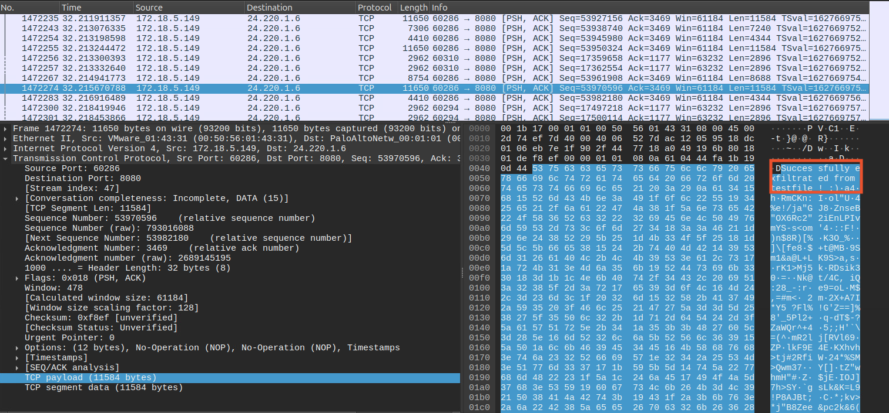

# Data Exfiltration through Ookla's Speedtest
<!-- ABOUT THE PROJECT -->
## About the Project
This project demonstrates the possibility of data exfiltration through Ookla's Speedtest traffic. Speedtest servers using HTTP (e.g. http://speedtest.midco.net) or Speedtest-CLI conduct Speedtests over plaintext. The TCP payloads from the client -> server can be overwritten without corrupting the Speedtest because no data integrity checks are in place. This makes Speedtest a strong C2 vector candidate, providing a unique opportunity to exfiltrate large datasets. 

<!-- GETTING STARTED -->
## How it Works
Speedtest measures upload and download speeds by sending large random data chunks to and from the server and client. These random data chunks are a sequence of bytes not checked by the client or server, and are just used to test the Internet speed.

When the upload speed is calculated, the client sends PSH/ACK packets with large TCP payloads containing the random data chunks to the server, which can be manipulated for data exfiltration. 

<!-- GETTING STARTED -->
## Getting Started

`speedtest-exfil.c` is a Linux Kernel Module (LKM) utilizing the Netfilter framework as a proof-of-concept (PoC) for exfiltrating data via Speedtest traffic. Please note this is not a universal data exfiltration tool, but rather a PoC to demonstrate the possibility of data exfiltration through Speedtest traffic. 

`speedtest-exfil.c` contains two primary functions: 
- `max_bytes_exfiled()` overwrites the entire TCP payload and calculates the maximum number of bytes that can be exfiltrated in a single Speedtest. 
- `exfil_file()` exfiltrates a test file from the client machine. 

This LKM was tested on Ubuntu 24.04 with kernel version 6.8. GCC needed for `Makefile`.

### Prerequisites

It is highly recommended to run this code within a virtual machine with at least 16GB of RAM.

Modify the code to include your source IP address and the function you want to run (`max_bytes_exfiled()` or `exfil_file()`). When using `exfil_file()`, modify the file path to the test file you want to exfiltrate. Both functions cannot run within the program - comment out the function call you are not using. 

Need root privileges. 

### Installation

1. Clone the repo
   ```sh
   git clone https://github.com/janessapalmieri/speedtest-data-exfil.git
   ```
2. Modify the `speedtest-exfil.c` as described in the Prerequisites section. 
3. Make
   ```sh
   make
   ```
4. Insert LKM
   ```sh
   insmod speedtest-exfil.ko
   ```
5. Navigate to a Speedtest HTTP server (e.g. http://speedtest.midco.net) or use the [Speedtest-CLI](https://www.speedtest.net/apps/cli)
6. Observe the packets using Wireshark or use `receiver.py`.
   - If using `receiver.py`, you need to have Python and the Python library [Scapy](https://scapy.readthedocs.io/en/latest/installation.html) installed.
   - Run `receiver.py` on either the client or a passive observer (any device that can observe packets from the client)
        ```sh
        python3 receiver.py
        ```
10. Run the Speedtest! Hit GO
11. Remove LKM 
   ```sh
   rmmod speedtest-exfil.ko
   ```
11. Clean
   ```sh
   make clean
   ```   
<!-- USAGE EXAMPLES -->
## Usage

Figure 1 demonstrates the `exfil_file()` function in `speedtest-exfil.c` observed in Wireshark. 
<p align="center">
  
  <br>
  <em>Figure 1: PCAP screenshot</em>
</p>

<!-- ACKNOWLEDGMENTS -->
## Acknowledgments

I want to thank my mentor, Dr. Andrew Kramer of Dakota State University, for providing the original idea that inspired this project and for their continuous guidance and support throughout my career in cybersecurity. 

## References
- Building the LKM: https://infosecwriteups.com/linux-kernel-communication-part-1-netfilter-hooks-15c07a5a5c4e
- List of servers available via Speedtest-CLI: https://williamyaps.github.io/wlmjavascript/servercli.html


