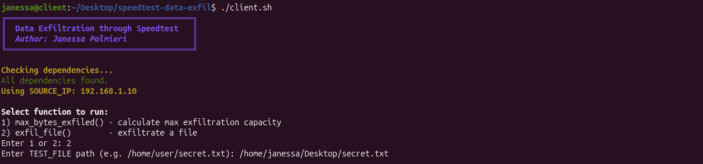
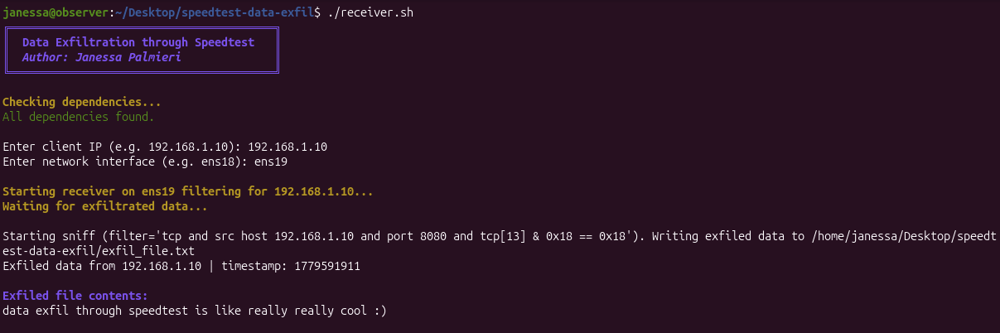
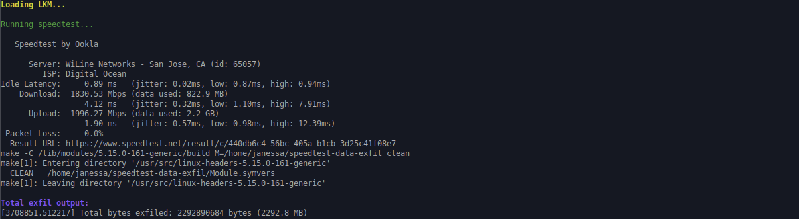

# Data Exfiltration through Ookla's Speedtest

## 📌 About
This project demonstrates data exfiltration through Ookla's Speedtest traffic. Speedtest servers using HTTP (e.g. `http://speedtest.midco.net`) or Speedtest-CLI conduct tests over plaintext — TCP payloads from client → server can be overwritten without corrupting the test, as no data integrity checks are in place. This makes Speedtest a strong C2 vector candidate for exfiltrating large datasets.

> This repository accompanies the IEEE publication *Leveraging Internet Speed Tests as a Covert Channel*, presented at the 2025 Cyber Awareness Research Symposium (CARS).

## 🔍 How it Works
Speedtest measures upload/download speeds by sending large random data chunks between client and server. These chunks are not integrity-checked — they simply measure throughput.

During upload, the client sends **PSH/ACK packets** with large TCP payloads containing these random chunks. Since the server never validates the payload content, the data can be replaced with arbitrary exfiltrated data.

## ⚙️ Getting Started

`speedtest-exfil.c` is a Linux Kernel Module (LKM) using the Netfilter framework as a proof-of-concept (PoC) for exfiltrating data via Speedtest traffic.

> ⚠️ This is a PoC, not a universal exfiltration tool. Tested on the current LTS version: Ubuntu 26.04 LTS (Resolute Raccoon 🦝) with kernel version 7.0

### Primary Functions
| Function | Description | 
|---|---|
| `max_bytes_exfiled()` | Overwrites the entire TCP payload of each upload PSH/ACK packet and calculates the maximum bytes exfiltrable in a single Speedtest |
| `exfil_file()` | Exfiltrates a test file from the client machine; Use an observer machine to reconstruct file with receiver.sh |

> ⚠️ Only one function can run at a time — `client.sh` handles this automatically.

### 📦 Prerequisites
- Virtual machine recommended (16 GB RAM minimum)
- Root privileges required
- Client Dependencies: `gcc`, `make`, `speedtest-cli`
- Observer/Receiver dependencies: `python3` + `scapy`

### 🛠️ Installation & Usage

1. **Clone the repo**
   ```sh
   git clone https://github.com/janessapalmieri/speedtest-data-exfil.git
   ```

2. **On the client machine, run:**
   ```sh
   ./client.sh
   ```
   - Select a function to run:
     - `max_bytes_exfiled()` — calculates max exfiltration capacity
     - `exfil_file()` — exfiltrates a file; prompts for file path
   - Automatically builds, loads the LKM, runs the Speedtest, and cleans up

3. **On the observer/receiver machine, run:**
   ```sh
   ./receiver.sh
   ```
   - Prompts for client IP and network interface
   - Sniffs for exfiltrated data using temporal stamping
   - Prints exfiltrated file contents on capture

## 🚀 Usage

<p align="center">
  
  <br>
  <em>Figure 1: client.sh exfiltrating a file</em>
</p>

<p align="center">
  
  <br>
  <em>Figure 2: receiver.sh capturing exfiltrated file</em>
</p>

<p align="center">
  
  <br>
  <em>Figure 3: client.sh with max_bytes_exfiled() exfiltrating ~2.2 GB within a single Speedtest on a Digital Ocean Droplet</em>
</p>

## 💡 Acknowledgments

I would like to thank my mentor, Dr. Andrew Kramer of Dakota State University, for providing the original idea that inspired this project and for his continuous guidance and support throughout my career in cybersecurity.

## 📚 References

1. Palmieri, J., & Kramer, A. (2025). *Leveraging Internet Speed Tests as a Covert Channel for Data Exfiltration.* In Proceedings of the 2025 Cyber Awareness and Research Symposium (CARS) (pp. 1–7). IEEE. https://doi.org/10.1109/CARS67163.2025.11337658

2. Infosec Writeups. (n.d.). *Linux Kernel Communication Part 1: Netfilter Hooks.* Retrieved from https://infosecwriteups.com/linux-kernel-communication-part-1-netfilter-hooks-15c07a5a5c4e

3. Yaps, W. (n.d.). *List of servers available via Speedtest-CLI.* Retrieved from https://williamyaps.github.io/wlmjavascript/servercli.html

