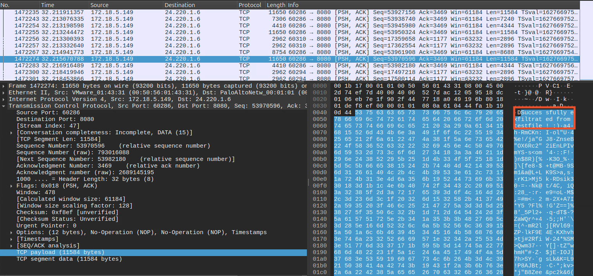

# Data Exfiltration through Ookla's Speedtest

## 📌 About
This project demonstrates data exfiltration through Ookla's Speedtest traffic. Speedtest servers using HTTP (e.g. `http://speedtest.midco.net`) or Speedtest-CLI conduct tests over plaintext — TCP payloads from client → server can be overwritten without corrupting the test, as no data integrity checks are in place. This makes Speedtest a strong C2 vector candidate for exfiltrating large datasets.

> This repository accompanies the IEEE publication *Leveraging Internet Speed Tests as a Covert Channel*, presented at the 2025 Cyber Awareness Research Symposium (CARS).

---

## 🔍 How it Works
Speedtest measures upload/download speeds by sending large random data chunks between client and server. These chunks are not integrity-checked — they simply measure throughput.

During upload, the client sends **PSH/ACK packets** with large TCP payloads containing these random chunks. Since the server never validates the payload content, the data can be replaced with arbitrary exfiltrated data.

---

## ⚙️ Getting Started

`speedtest-exfil.c` is a Linux Kernel Module (LKM) using the Netfilter framework as a proof-of-concept (PoC) for exfiltrating data via Speedtest traffic.

> ⚠️ This is a PoC, not a universal exfiltration tool. Tested on Ubuntu 24.04 — kernel 6.8.

### Primary Functions
| Function | Description |
|---|---|
| `max_bytes_exfiled()` | Overwrites the entire TCP payload and calculates the maximum bytes exfiltrable in a single Speedtest |
| `exfil_file()` | Exfiltrates a test file from the client machine |

> ⚠️ Only one function can run at a time — comment out the one you are not using.

---

### 📦 Prerequisites
- Virtual machine recommended (16 GB RAM minimum)
- Root privileges required
- Dependencies: `gcc`, `make`
- Optional: Python + [Scapy](https://scapy.readthedocs.io/en/latest/installation.html) for `receiver.py`

---

### 🛠️ Installation & Usage

1. **Clone the repo**
   ```sh
   git clone https://github.com/janessapalmieri/speedtest-data-exfil.git
   ```
2. Configure `speedtest-exfil.c`
   - Set the `TEST_FILE` and `SOURCE_IP` constants
   - Comment out the function you are not using (`max_bytes_exfiled()` or `exfil_file()`)
3. Make
   ```sh
   make
   ```
4. Insert LKM
   ```sh
   insmod speedtest-exfil.ko
   ```
5. Start the observer (optional)
   - Run `receiver.py` on the client or any passive observer - requires Python and Scapy
     ```sh
     python3 receiver.py
     ```
6. Run the Speedtest
   -  ```markdown
### 🛠️ Installation & Usage

1. **Clone the repo**
   ```sh
   git clone https://github.com/janessapalmieri/speedtest-data-exfil.git
   ```

2. **Configure** `speedtest-exfil.c`
   - Set the `TEST_FILE` and `SOURCE_IP` constants
   - Comment out the function you are not using (`max_bytes_exfiled()` or `exfil_file()`)

3. **Build**
   ```sh
   make
   ```

4. **Insert the LKM**
   ```sh
   insmod speedtest-exfil.ko
   ```

5. **Start the observer** *(optional)*
   - Run `receiver.py` on the client or any passive observer — requires Python and [Scapy](https://scapy.readthedocs.io/en/latest/installation.html)
   ```sh
   python3 receiver.py
   ```

6. **Run the Speedtest**
   - Navigate to a Speedtest HTTP server (e.g. `http://speedtest.midco.net`) or use [Speedtest-CLI](https://www.speedtest.net/apps/cli) and hit **Go**

7. **Cleanup**
   ```sh
   rmmod speedtest-exfil.ko
   make clean
   ```

---

## 🚀 Usage

Figure 1 shows the `exfil_file()` function observed in Wireshark.

<p align="center">
  
  <br>
  <em>Figure 1: PCAP screenshot of exfiltrated data</em>
</p>

---

## 💡 Acknowledgments

I would like to thank my mentor, Dr. Andrew Kramer of Dakota State University, for providing the original idea that inspired this project and for his continuous guidance and support throughout my career in cybersecurity.

---

## 📚 References

1. Palmieri, J., & Kramer, A. (2025). *Leveraging Internet Speed Tests as a Covert Channel for Data Exfiltration.* In Proceedings of the 2025 Cyber Awareness and Research Symposium (CARS) (pp. 1–7). IEEE. https://doi.org/10.1109/CARS67163.2025.11337658

2. Infosec Writeups. (n.d.). *Linux Kernel Communication Part 1: Netfilter Hooks.* Retrieved from https://infosecwriteups.com/linux-kernel-communication-part-1-netfilter-hooks-15c07a5a5c4e

3. Yaps, W. (n.d.). *List of servers available via Speedtest-CLI.* Retrieved from https://williamyaps.github.io/wlmjavascript/servercli.html

